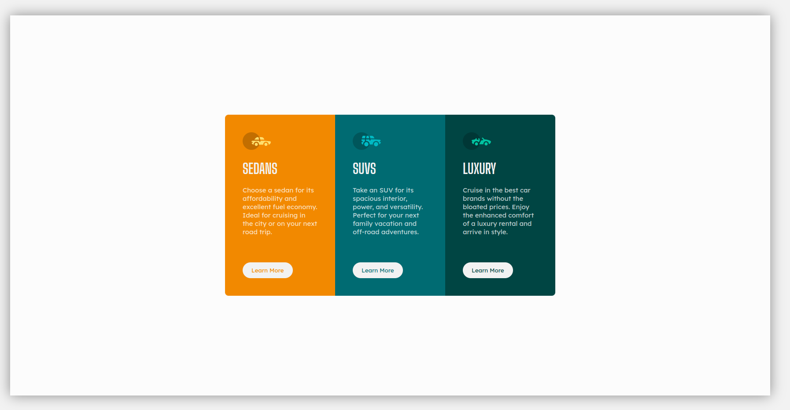
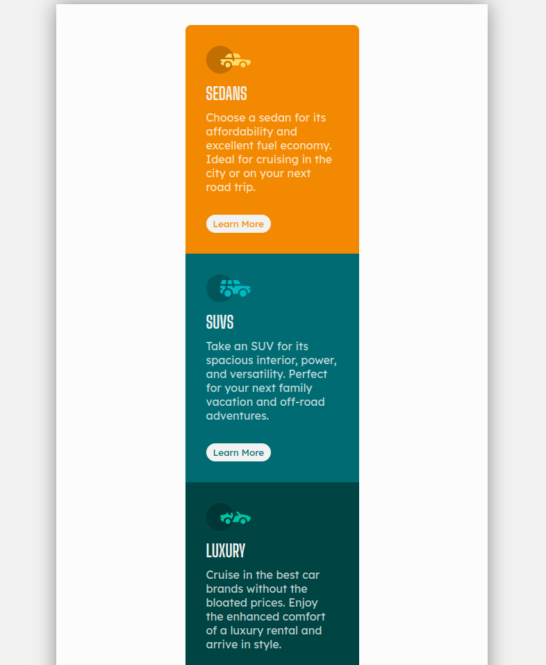
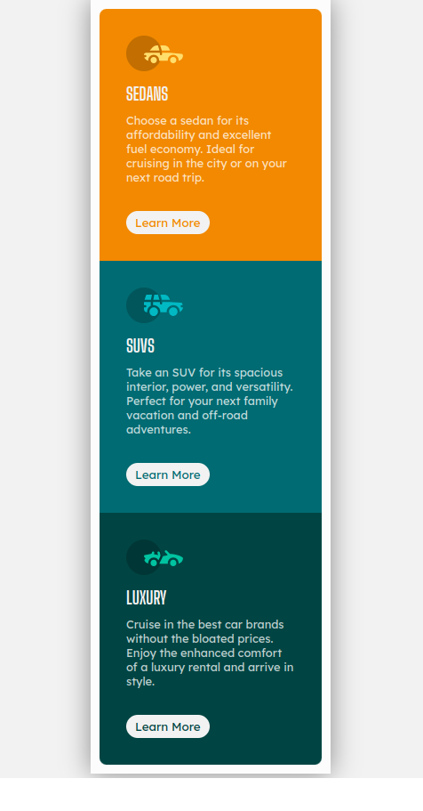

## Overview
### The Challenge
To create a responsive layout that suits different screen sizes.

#### Desktop view


#### Tablet view


#### Mobile view


## My process
### Built with
- Semantic HTML5 markup
- CSS custom properties
- Flexbox
- Media queries

### What I learned
- Learnt to use media query.
- Learnt about overflow propery in css.
- Learn how box-sizing property works.
```
@media only screen and (max-width: 850px) {
  .card-container {
    padding: 10px;
    overflow: auto;
    height:100%;
    width:100%;
  }
}
```

### Useful resources
- [CSS-TRICKS](https://css-tricks.com/snippets/css/a-guide-to-flexbox/) Complete guide to Flexbox.
- [Mdn Docs](https://developer.mozilla.org/en-US/docs/Web/CSS/overflow) Complete guide to overflow in CSS.
